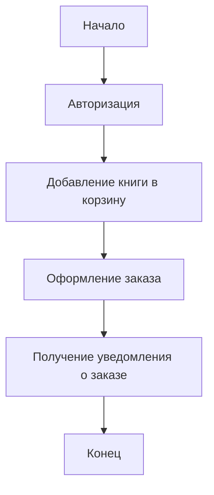
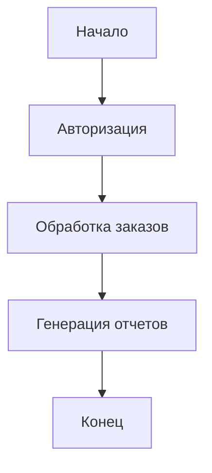
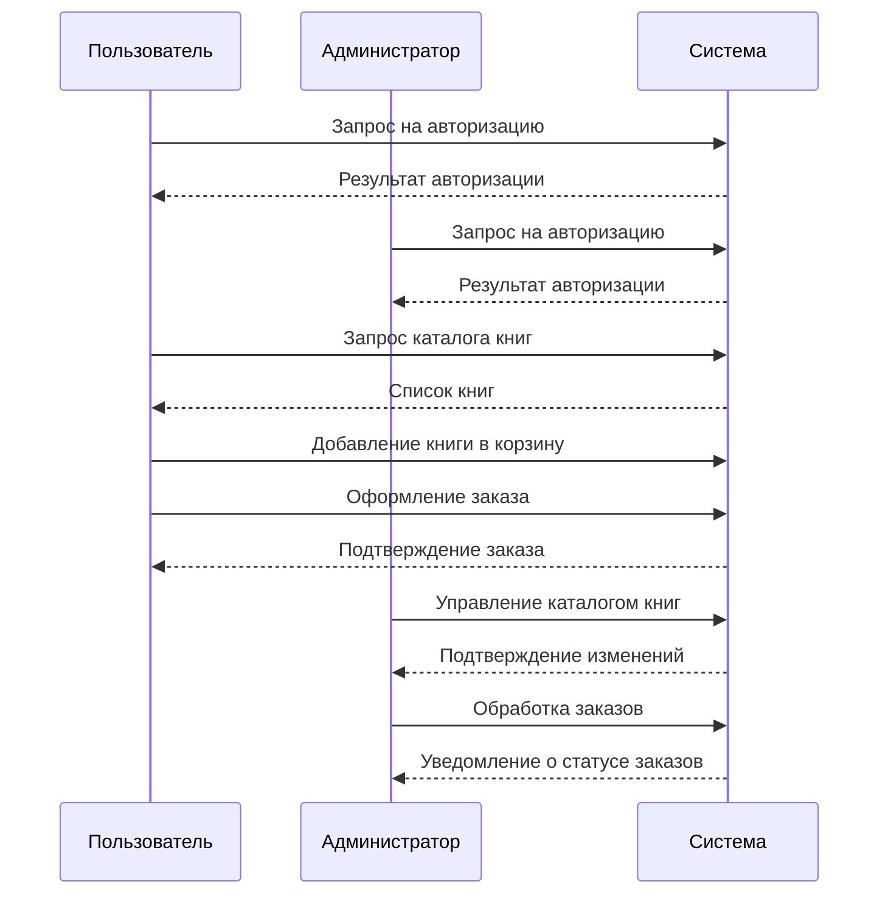

# Книжный магазин

## Авторы:
- Шилин И.
- Плюхин Д.
- Василегин В.

## Описание проекта

Проект представляет собой систему управления книжным магазином. Основной функционал включает возможность просмотра доступных книг, добавления их в корзину, оформления заказа, управления запасами книг и авторизации пользователей. Система рассчитана на работу как с индивидуальными пользователями, так и с администраторами магазина.

## Описание системы

### Целевая аудитория
- Пользователи, заинтересованные в покупке книг.
- Администраторы магазина для управления запасами и заказами.

### Примерный расчет количества пользователей
- Система рассчитана на _N_ пользователей одновременно.

## Use Cases

### Основные случаи использования:
1. **Пользователь:**
   - Авторизуется в системе.
   - Просматривает каталог книг.
   - Добавляет книги в корзину.
   - Оформляет заказ.
   - Получает уведомления о статусе заказа.

2. **Администратор:**
   - Авторизуется в системе.
   - Управляет каталогом книг (добавление, редактирование, удаление).
   - Обрабатывает заказы.
   - Генерирует отчеты о продажах.

3. **Система:**
   - Обеспечивает доступ к информации о наличии и характеристиках книг.
   - Обрабатывает запросы пользователей и администраторов.
   - Отправляет уведомления пользователям и администраторам.

## Диаграмма активности

### Диаграмма активности для пользователя

### Диаграмма активности для администратора

### Диаграмма последовательности для пользователя, администратора и системы
