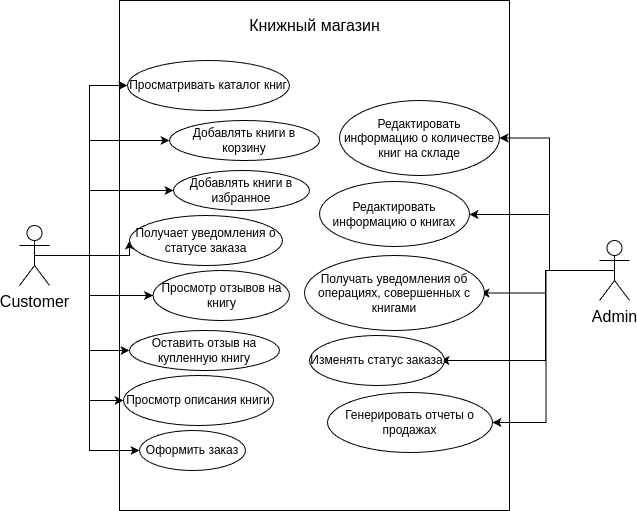
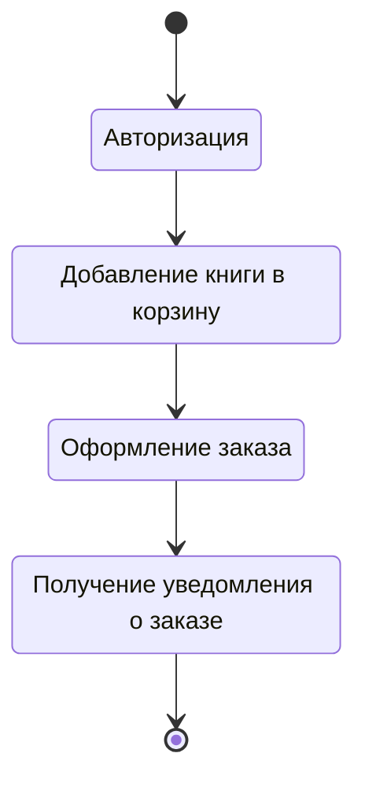
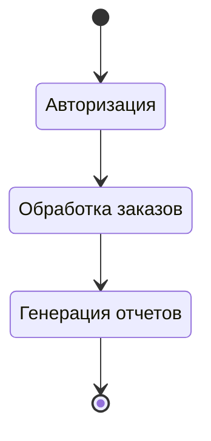
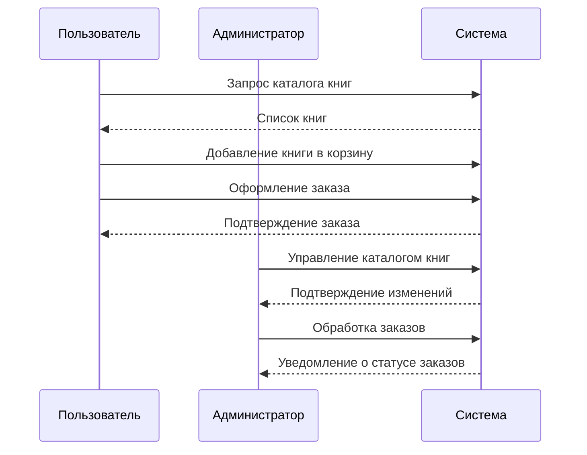

# Книжный магазин

## Авторы:
- Шилин И.
- Плюхин Д.
- Василегин В.

## Описание проекта

Проект представляет собой систему управления книжным магазином. 
Основной функционал включает возможность просмотра доступных книг, добавления их в корзину, оформления заказа, управления запасами книг и авторизации пользователей. Система рассчитана на работу как с пользователями, так и с администраторами магазина.

## Описание системы

### Целевая аудитория
- Покупатели книг.
- Администраторы магазина.

### Примерный расчет количества пользователей
- Система рассчитана на _N_ пользователей одновременно.

## Use Cases

1. **Пользователь:**
   - Просматривать каталог книг.
   - Добавлять книги в корзину.
   - Добавлять книги в избранное.
   - Просмотр описания книги.
   - Просмотр отзывов на книгу.
   - Оставить отзыв на купленную книгу.
   - Оформить заказ.
   - Получает уведомления о статусе заказа.

2. **Администратор:**
   - Редактировать информацию о количестве книг на складе.
   - Редактировать информацию о книгах.
   - Получать уведомления об операциях, совершенных с книгами.
   - Изменять статус заказа.
   - Генерировать отчеты о продажах.

## Диаграмма активности

### Диаграмма активности для пользователя

### Диаграмма активности для администратора

### Диаграмма последовательности для пользователя, администратора и системы
